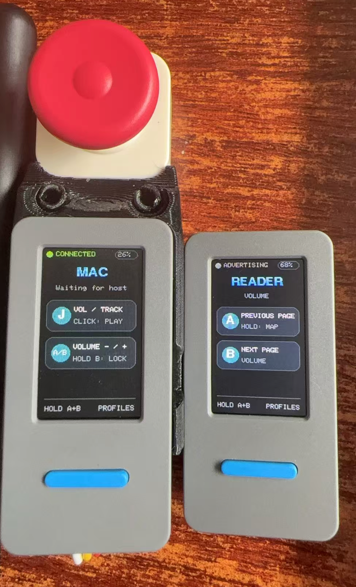

# StickS3 Remote

把 M5Stack StickS3 变成一枚小巧的蓝牙多设备遥控器。固件基于 ESP-IDF，支持 macOS 媒体控制、iPhone 相机快门、阅读器翻页，并可自动识别可选的 Unit Joystick2。

<p align="center">
  
</p>

> 当前状态：可在真实 StickS3、MacBook Air 和 iPhone 上运行。Reader 模式需要阅读器系统本身支持 BLE HID；CrossMux 当前可能无法接收蓝牙按键。

## 功能

- 一个固件包含 `MAC`、`CAMERA`、`READER` 和预留的 `IR REMOTE` 配置。
- 同时提供标准键盘和 Consumer Control HID 报告。
- 支持蓝牙安全配对、保存绑定信息和自动重连。
- 适配 StickS3 竖屏，显示连接状态、电量、当前配置和按键说明。
- 可单独使用 StickS3 的 A/B 键。
- 可选 Unit Joystick2；启动时通过 Grove I²C 自动检测，不需要刷不同固件。
- 配置和 Reader 键位映射保存在 NVS，重启后继续使用。

## 硬件

必需：

- [M5Stack StickS3](https://docs.m5stack.com/en/core/StickS3)
- USB-C 数据线

可选：

- [Unit Joystick2](https://docs.m5stack.com/en/unit/Unit-JoyStick2)
- Grove 连接线（StickS3 使用 GPIO9/GPIO10 作为外部 I²C）

Joystick2 默认地址为 `0x63`。固件只在检测到模块时打开外部输出；未连接模块时继续使用 A/B 双键界面。

## 使用方法

设备蓝牙名称为 `S3V2`。首次使用时，在 Mac、iPhone 或其他主机的蓝牙设置中选择它，并完成系统显示的配对步骤。

长按 `A+B` 进入配置选择：

- A：下一个配置
- B：确认
- 再次长按 A+B：取消选择并返回

### 不连接 Joystick2

| 配置 | A | B | 长按 A | 长按 B |
| --- | --- | --- | --- | --- |
| MAC | 音量减 | 音量加 | 静音 | 锁定屏幕 |
| CAMERA | 快门 / 音量加 | 快门 / 音量减 | — | — |
| READER | 上一页 | 下一页 | 切换映射 | — |
| IR REMOTE | 预留 | 预留 | — | — |

`CAMERA` 利用 iOS 相机支持的音量键快门行为。请先打开 iPhone 系统相机，再按 A 或 B。

Reader 支持三套映射，长按 A 循环切换：

- `VOLUME`：音量加/减
- `ARROWS`：方向键左/右
- `PAGE KEYS`：Page Up/Page Down

### 连接 Joystick2

| 配置 | 摇杆操作 | 功能 |
| --- | --- | --- |
| MAC | 上 / 下 | 音量加 / 减 |
| MAC | 左 / 右 | 上一首 / 下一首 |
| MAC | 单击 | 播放 / 暂停 |
| MAC | 长按 | 锁定屏幕 |
| CAMERA | 单击、上或下 | 快门 |
| READER | 左或上 / 右或下 | 上一页 / 下一页 |

A/B 键在连接 Joystick2 后仍然可用。

## 构建和烧录

### 环境要求

- ESP-IDF 5.5.x（本项目实机验证版本为 5.5.4）
- Python 和 ESP-IDF 工具链
- M5Unified 0.2.21 或兼容版本（由 ESP Component Manager 自动下载）

克隆并进入固件工程：

```bash
git clone https://github.com/JoeFirmament/M5Stack_stickS3_remote.git
cd M5Stack_stickS3_remote/StickS3EspIdfHid
```

加载 ESP-IDF 环境，设置目标并构建：

```bash
source ~/esp/esp-idf/export.sh
idf.py set-target esp32s3
idf.py build
```

让 StickS3 进入下载模式：连接 USB-C，长按侧键约 2 秒，看到内部绿灯闪烁后松开。然后查找串口并烧录：

```bash
ls /dev/cu.usbmodem*
idf.py -p /dev/cu.usbmodemXXXX flash monitor
```

按 `Ctrl+]` 退出串口监视器。烧录完成后若屏幕仍为空白，单击一次侧键即可退出下载模式并启动固件。

## 配对提示

- 切换 `MAC`、`CAMERA`、`READER` 只改变按键映射，目前不会改变蓝牙设备身份。
- 已配对主机可能主动自动重连。测试另一台设备前，先在原主机关闭蓝牙或忽略 `S3V2`。
- 遇到“已连接但无按键”时，可在主机上忽略设备，重启 StickS3 后重新配对。
- 进入关机或深度睡眠会断开 BLE；重新开机后需要等待主机自动回连。

## 项目结构

```text
StickS3EspIdfHid/       生产固件（ESP-IDF）
  main/                 BLE HID、UI、A/B 和 Joystick2 逻辑
  TODO.md               后续功能路线图
StickS3HardwareTest/    StickS3 屏幕与按键测试
StickS3CameraTest/      iPhone 快门验证程序
StickS3IphoneKeyTest/   iOS 键盘 HID 验证程序
StickS3BleHidTest/      Arduino BLE HID 实验程序
StickS3CliSmokeTest/    Arduino CLI 烧录冒烟测试
docs/images/            README 图片
```

## 路线图

- Sony A7M4 遥控配置：模拟 Sony RMT-P1BT，支持 AF-ON、快门和录像。
- 为 Mac、iPhone 和其他主机提供独立蓝牙身份，避免错误自动重连。
- 实现 IR REMOTE 的红外学习、命名、保存和发射。
- 增加屏幕自动熄灭和低功耗策略。

更详细的计划见 [TODO.md](StickS3EspIdfHid/TODO.md)。

## 说明

本项目仍在开发中。不同系统和第三方固件对 BLE HID Consumer Control、键盘按键及自动重连的支持可能不同，请以实际设备测试结果为准。
